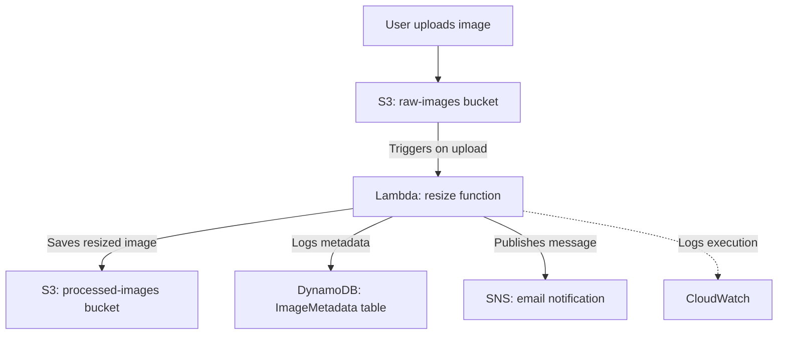

# Serverless Image Processing Pipeline

A serverless AWS project that automatically resizes uploaded images, logs metadata, and sends email notifications — built with S3, Lambda, DynamoDB, and SNS.

## Architecture

## What it does

I built a serverless image-processing pipeline on AWS. It's event-driven — when a user uploads an image to an S3 bucket, that upload automatically triggers a Lambda function, so there's no server running and waiting around; it only runs when something actually happens.

The Lambda function, written in Python, downloads the image, resizes it using the Pillow library, and saves the resized version into a second S3 bucket. At the same time, it writes a metadata record into a DynamoDB table, so there's a queryable history of every image processed. It also publishes a message through SNS, which sends an email notification confirming the image was processed.

## Tech stack
- **S3** — storage for raw and processed images
- **Lambda (Python)** — resize logic, triggered by S3 events
- **DynamoDB** — structured metadata log
- **SNS** — email notifications
- **CloudWatch** — logging and debugging
- **Pillow (via Klayers Lambda Layer)** — image resizing library

## Real issues I debugged (from CloudWatch logs)
- S3 event keys are URL-encoded — fixed with `unquote_plus()` after hitting a `NoSuchKey` error
- DynamoDB rejected writes until the item's key name matched the table's actual partition key exactly
- SNS `publish()` failed with an invalid ARN until the placeholder was replaced with the real Topic ARN

## Screenshots

**CloudWatch — successful execution**

**DynamoDB — logged metadata**

**S3 — resized image output**

**SNS — email notification received**

## Lambda function code
See [`lambda_function.py`](lambda_function.py)
